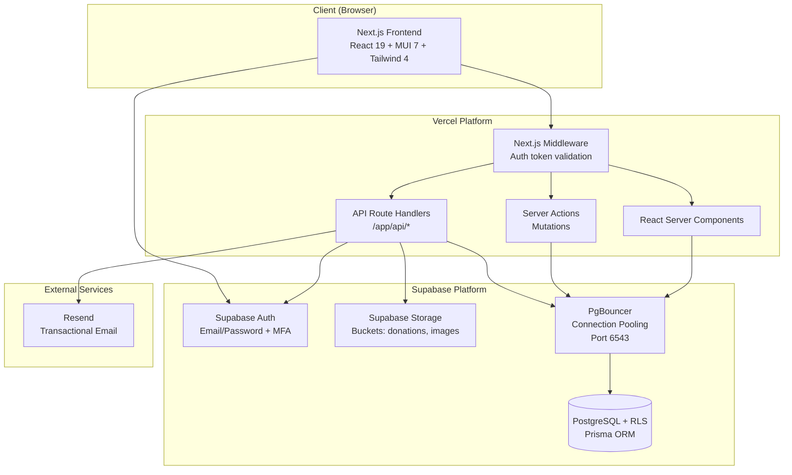
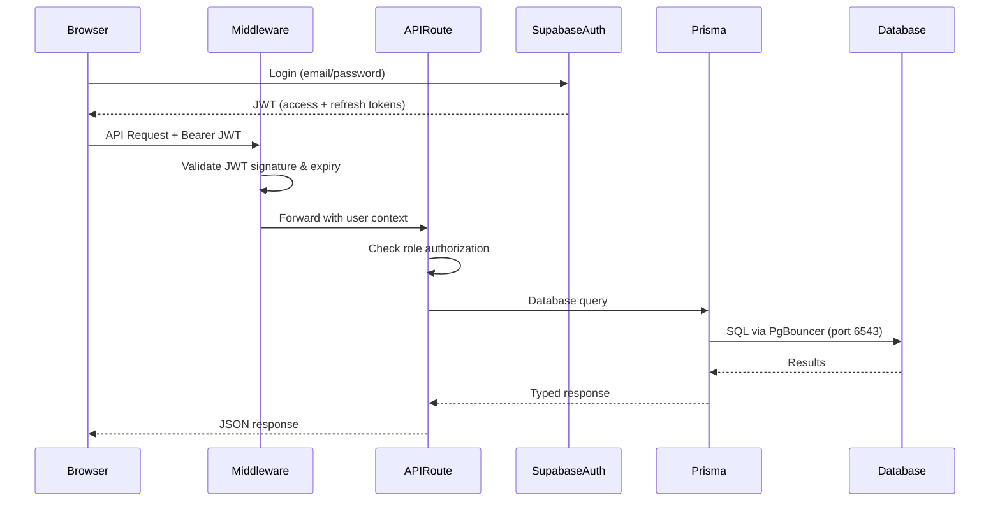

# Design Document: AWS to Vercel/Supabase Migration

## Overview

This design describes the consolidation of seven separate AWS-based codebases into a single Next.js 16 monorepo deployed on Vercel with Supabase as the backend platform. The migration replaces:

- **AWS Cognito** → Supabase Auth (email/password, MFA, role-based access)
- **AWS Lambda/ECS Express backends** → Next.js API Route Handlers
- **AWS S3** → Supabase Storage
- **AWS SES/SNS** → Resend (email service)
- **AWS-hosted PostgreSQL** → Supabase managed PostgreSQL (same Prisma ORM)

The existing frontend already uses Next.js 16 with App Router, so frontend migration is primarily consolidation of the two frontend apps (tcc-ecotrack-frontend and tcc-cognito-frontend) into one. Backend migration involves converting Express.js route handlers into Next.js API route handlers while preserving existing business logic.

### Key Design Decisions

1. **Resend for email**: Chosen over SendGrid or Supabase Edge Functions with SMTP because Resend has first-class Vercel integration, a simple SDK, and generous free tier. It supports React Email templates natively.

2. **Prisma ORM retained**: The existing codebase already uses Prisma with `@prisma/adapter-pg`. Migrating to Supabase's managed Postgres requires only a connection string change and switching from `@prisma/adapter-pg` to Prisma's direct PostgreSQL connection via Supabase's pooled connection (port 6543).

3. **Single monorepo (no Turborepo)**: Given the relatively modest codebase size and single deployable unit, a flat Next.js App Router structure is simpler than introducing a monorepo tool. Shared logic lives in `/lib` directories.

4. **Row Level Security at database level**: RLS policies complement application-level checks. Application middleware validates JWTs and roles; RLS provides defense-in-depth at the database layer.

5. **Server Actions for mutations, API Routes for complex endpoints**: Simple form submissions use Server Actions. Complex endpoints (CSV processing, analytics queries, PDF generation) use API Route Handlers for better control over streaming, file uploads, and response formats.

## Architecture



### Request Flow



### Project Structure

```
ecotrack/
├── app/
│   ├── (auth)/                    # Auth pages (login, register, reset)
│   │   ├── login/page.tsx
│   │   ├── register/page.tsx
│   │   └── reset-password/page.tsx
│   ├── (dashboard)/               # Protected dashboard pages
│   │   ├── layout.tsx             # Shared dashboard layout with nav
│   │   ├── overview/page.tsx
│   │   ├── inventory/
│   │   ├── donations/
│   │   ├── analytics/
│   │   ├── csv-upload/
│   │   ├── users/                 # Admin user management
│   │   └── settings/
│   ├── api/
│   │   ├── auth/                  # Auth endpoints (callback, session)
│   │   ├── users/                 # User management CRUD
│   │   ├── inventory/             # Item types, transactions, balances
│   │   ├── donations/             # Donation drives
│   │   ├── csv/                   # CSV upload, validate, approve
│   │   ├── analytics/             # Collection, assembly, overview
│   │   ├── reports/               # PDF report generation
│   │   ├── storage/               # Image upload proxies
│   │   └── health/                # Health check endpoint
│   ├── layout.tsx                 # Root layout
│   └── page.tsx                   # Landing/redirect
├── lib/
│   ├── supabase/
│   │   ├── client.ts              # Browser Supabase client
│   │   ├── server.ts              # Server-side Supabase client
│   │   └── admin.ts               # Service-role Supabase client
│   ├── prisma/
│   │   ├── client.ts              # Prisma client singleton
│   │   └── schema.prisma          # Unified schema
│   ├── auth/
│   │   ├── middleware.ts          # JWT validation helpers
│   │   └── roles.ts              # Role hierarchy & permission checks
│   ├── email/
│   │   └── resend.ts             # Resend client & templates
│   ├── csv/
│   │   ├── parser.ts             # CSV/Excel parsing logic
│   │   ├── validator.ts          # Row validation against DB
│   │   └── processor.ts          # Approved file DB writer
│   ├── inventory/
│   │   ├── transactions.ts       # Transaction state machine
│   │   └── balance.ts            # Inventory balance calculations
│   ├── analytics/
│   │   ├── collection.ts         # Collection analytics queries
│   │   ├── assembly.ts           # Assembly/recipe calculations
│   │   └── overview.ts           # Overview statistics
│   └── reports/
│       └── pdf.ts                # PDF generation with PDFKit
├── middleware.ts                   # Next.js middleware (auth check)
├── prisma/
│   ├── schema.prisma              # Unified Prisma schema
│   └── migrations/                # Prisma Migrate files
├── package.json
├── next.config.ts
├── vercel.json
└── .env.local                     # Local env (not committed)
```

## Components and Interfaces

### 1. Authentication Module (`lib/supabase/`, `lib/auth/`)

**Supabase Client Factory** — Creates appropriately scoped Supabase clients:

```typescript
// lib/supabase/server.ts
import { createServerClient } from '@supabase/ssr'
import { cookies } from 'next/headers'

export async function createSupabaseServerClient() {
  const cookieStore = await cookies()
  return createServerClient(
    process.env.NEXT_PUBLIC_SUPABASE_URL!,
    process.env.NEXT_PUBLIC_SUPABASE_ANON_KEY!,
    {
      cookies: {
        getAll: () => cookieStore.getAll(),
        setAll: (cookiesToSet) => {
          cookiesToSet.forEach(({ name, value, options }) =>
            cookieStore.set(name, value, options)
          )
        },
      },
    }
  )
}

// lib/supabase/admin.ts
import { createClient } from '@supabase/supabase-js'

export const supabaseAdmin = createClient(
  process.env.NEXT_PUBLIC_SUPABASE_URL!,
  process.env.SUPABASE_SERVICE_ROLE_KEY!,
  { auth: { autoRefreshToken: false, persistSession: false } }
)
```

**Role Authorization** — Centralized role checking:

```typescript
// lib/auth/roles.ts
export type UserRole = 'Admin' | 'SchoolStaff' | 'PsgVolunteer' | 'Parent'

const ROLE_HIERARCHY: Record<UserRole, number> = {
  Admin: 4,
  SchoolStaff: 3,
  PsgVolunteer: 2,
  Parent: 1,
}

export interface RoutePermission {
  minRole?: UserRole
  allowedRoles?: UserRole[]
}

export function hasPermission(userRole: UserRole, permission: RoutePermission): boolean {
  if (permission.allowedRoles) {
    return permission.allowedRoles.includes(userRole)
  }
  if (permission.minRole) {
    return ROLE_HIERARCHY[userRole] >= ROLE_HIERARCHY[permission.minRole]
  }
  return true
}
```

**Middleware** — Validates JWT and attaches user context:

```typescript
// middleware.ts
import { createServerClient } from '@supabase/ssr'
import { NextResponse, type NextRequest } from 'next/server'

const PUBLIC_PATHS = ['/login', '/register', '/reset-password', '/api/health']

export async function middleware(request: NextRequest) {
  const { pathname } = request.nextUrl

  if (PUBLIC_PATHS.some(p => pathname.startsWith(p))) {
    return NextResponse.next()
  }

  const response = NextResponse.next()
  const supabase = createServerClient(/* ... cookie handling ... */)
  const { data: { user }, error } = await supabase.auth.getUser()

  if (error || !user) {
    if (pathname.startsWith('/api/')) {
      return NextResponse.json({ error: 'Unauthorized' }, { status: 401 })
    }
    return NextResponse.redirect(new URL('/login', request.url))
  }

  // Attach user role to request headers for downstream use
  const role = user.app_metadata?.role || 'Parent'
  response.headers.set('x-user-id', user.id)
  response.headers.set('x-user-role', role)

  return response
}
```

### 2. CSV Processing Module (`lib/csv/`)

**Parser** — Handles both CSV and Excel formats:

```typescript
// lib/csv/parser.ts
export interface ParsedRow {
  item_type_id: string
  size_name: string
  user_id: string
  school_id: string
  donation_drive_id: string
  to_stored_at: string
  quantity: string
  to_status: string
  [key: string]: string
}

export interface ParseResult {
  headers: string[]
  rows: ParsedRow[]
  totalRows: number
}

export function parseFile(buffer: Buffer, filename: string): ParseResult
```

**Validator** — Validates each row against database state:

```typescript
// lib/csv/validator.ts
export interface ValidationError {
  row: number
  field: string
  message: string
}

export interface ValidationResult {
  valid: boolean
  errors: ValidationError[]
  validRows: number
  invalidRows: number
}

export async function validateDonationCsv(
  rows: ParsedRow[],
  prisma: PrismaClient
): Promise<ValidationResult>
```

**Processor** — Writes approved data to database atomically:

```typescript
// lib/csv/processor.ts
export interface ProcessingResult {
  success: boolean
  transactionsCreated: number
  balancesUpdated: number
  error?: string
}

export async function processApprovedCsv(
  rows: ParsedRow[],
  prisma: PrismaClient
): Promise<ProcessingResult>
```

### 3. Inventory Module (`lib/inventory/`)

**Transaction State Machine** — Enforces status transitions:

```typescript
// lib/inventory/transactions.ts
export type ItemStatus = 'ForSale' | 'ForRepurpose' | 'GeneralOffice' | 'Sold' | 'Repurposed' | 'Disposed'

const TERMINAL_STATUSES: ItemStatus[] = ['Sold', 'Repurposed', 'Disposed']

const ALLOWED_TRANSITIONS: Record<ItemStatus, ItemStatus[]> = {
  ForSale: ['Sold', 'ForRepurpose', 'Disposed', 'GeneralOffice'],
  ForRepurpose: ['Repurposed', 'ForSale', 'Disposed'],
  GeneralOffice: ['ForSale', 'ForRepurpose', 'Disposed'],
  Sold: [],        // terminal
  Repurposed: [],  // terminal
  Disposed: [],    // terminal
}

export function isValidTransition(from: ItemStatus | null, to: ItemStatus): boolean {
  if (from === null) return true // Initial donation
  if (TERMINAL_STATUSES.includes(from)) return false
  return ALLOWED_TRANSITIONS[from]?.includes(to) ?? false
}
```

**Balance Manager** — Atomic inventory updates:

```typescript
// lib/inventory/balance.ts
export async function updateInventoryBalance(
  prisma: PrismaClient,
  params: {
    itemTypeId: number
    sizeOptionId: number
    fromStatus?: ItemStatus
    toStatus: ItemStatus
    fromStoredAt?: StorageLocation
    toStoredAt: StorageLocation
    quantity: number
  }
): Promise<void>
```

### 4. Email Service (`lib/email/`)

```typescript
// lib/email/resend.ts
import { Resend } from 'resend'

const resend = new Resend(process.env.RESEND_API_KEY)

export async function sendCsvValidationEmail(params: {
  to: string
  fileName: string
  status: 'passed' | 'failed'
  totalRows: number
  failedRows?: number
  errors?: Array<{ row: number; message: string }>
}): Promise<void>

export async function sendCsvProcessedEmail(params: {
  to: string[]
  fileName: string
  recordsProcessed: number
}): Promise<void>
```

### 5. Analytics Module (`lib/analytics/`)

Migrates existing Express controller logic into pure functions callable from API routes:

```typescript
// lib/analytics/collection.ts
export interface CollectionFilter {
  year: number
  startMonth?: number  // 1-12
  endMonth?: number    // 1-12
  schoolId?: number
}

export async function getCollectionAnalytics(
  prisma: PrismaClient,
  filter: CollectionFilter
): Promise<CollectionAnalyticsResult>

// lib/analytics/assembly.ts
export async function getRepurposeProjections(
  prisma: PrismaClient,
  schoolId?: number
): Promise<RepurposeProjection[]>

export async function calculateAssemblyPlan(
  prisma: PrismaClient,
  targetQuantities: Record<number, number>
): Promise<AssemblyPlanResult>
```

### 6. Storage Module (Supabase Storage)

File uploads flow through API Route Handlers that proxy to Supabase Storage:

```typescript
// app/api/csv/upload/route.ts
export async function POST(request: NextRequest) {
  const formData = await request.formData()
  const file = formData.get('file') as File
  
  // Validate file type and size
  // Upload to Supabase Storage donations/pre-processing/
  // Trigger validation
  // Return result
}
```

### 7. API Route Pattern

All API routes follow a consistent pattern:

```typescript
// app/api/[domain]/route.ts
import { NextRequest, NextResponse } from 'next/server'
import { prisma } from '@/lib/prisma/client'
import { requireRole } from '@/lib/auth/roles'

export async function GET(request: NextRequest) {
  const role = request.headers.get('x-user-role') as UserRole
  if (!requireRole(role, 'SchoolStaff')) {
    return NextResponse.json({ error: 'Forbidden' }, { status: 403 })
  }
  // Business logic...
}
```

## Data Models

### Prisma Schema Changes

The unified Prisma schema preserves the existing data model with these modifications:

1. **`cognito_sub` → `supabase_auth_id`**: The `User` model's `cognitoSub` field becomes `supabaseAuthId` storing the Supabase Auth UUID.

2. **Connection string**: Points to Supabase's pooled connection (port 6543).

3. **Single schema**: Combines all tables from both analytics-backend and inventory-backend schemas (they are already identical).

```prisma
// prisma/schema.prisma (key changes only)
datasource db {
  provider  = "postgresql"
  url       = env("DATABASE_URL") // Supabase pooled: postgres://...@db.xxx.supabase.co:6543/postgres
  directUrl = env("DIRECT_URL")   // Direct: postgres://...@db.xxx.supabase.co:5432/postgres
}

model User {
  id              Int       @id @default(autoincrement())
  supabaseAuthId  String    @unique @map("supabase_auth_id") @db.Uuid
  email           String    @unique @db.VarChar(255)
  phoneNumber     String?   @map("phone_number") @db.VarChar(20)
  firstName       String?   @map("first_name") @db.VarChar(100)
  lastName        String?   @map("last_name") @db.VarChar(100)
  fullName        String?   @map("full_name") @db.VarChar(100)
  role            UserRole  @default(Parent) @map("role")
  isActive        Boolean   @default(true) @map("is_active")
  userFlags       Json?     @default("{\"onboarding_completed\": false}") @map("user_flags") @db.JsonB
  numberChild     Int?      @default(0) @map("number_child")
  childDetails    Json?     @default("[]") @map("child_details") @db.JsonB
  createdDate     DateTime  @default(now()) @map("created_date")
  lastLogin       DateTime? @map("last_login")
  schoolId        Int?      @map("school_id")
  school          School?   @relation(fields: [schoolId], references: [id], onDelete: SetNull)
  // ... relations unchanged
  @@map("users")
}
```

### Supabase Auth User Metadata Structure

```json
{
  "app_metadata": {
    "role": "SchoolStaff",
    "provider": "email"
  },
  "user_metadata": {
    "first_name": "Jane",
    "last_name": "Smith",
    "full_name": "Jane Smith",
    "phone_number": "+6591234567"
  }
}
```

### Row Level Security Policies

```sql
-- Enable RLS on all tables
ALTER TABLE users ENABLE ROW LEVEL SECURITY;
ALTER TABLE transactions ENABLE ROW LEVEL SECURITY;
ALTER TABLE inventory_balance ENABLE ROW LEVEL SECURITY;
-- ... (all tables)

-- Admin: full access
CREATE POLICY "admin_full_access" ON users
  FOR ALL USING (
    (current_setting('request.jwt.claims', true)::json->>'role') = 'Admin'
  );

-- SchoolStaff: access rows for their school
CREATE POLICY "staff_school_access" ON transactions
  FOR ALL USING (
    (current_setting('request.jwt.claims', true)::json->>'role') = 'SchoolStaff'
    AND item_type_id IN (
      SELECT id FROM item_types WHERE school_id = (
        SELECT school_id FROM users 
        WHERE supabase_auth_id = auth.uid()
      )
    )
  );

-- Parent: own records only
CREATE POLICY "parent_own_records" ON users
  FOR SELECT USING (
    (current_setting('request.jwt.claims', true)::json->>'role') = 'Parent'
    AND supabase_auth_id = auth.uid()
  );
```

### Supabase Storage Buckets

| Bucket | Access Policy | Max Size | Allowed Types |
|--------|--------------|----------|---------------|
| `donations` | Authenticated upload & download | 10 MB | .csv, .xls, .xlsx |
| `images` | Authenticated upload, public download | 5 MB | .png, .jpg, .jpeg, .webp |

Folder structure within `donations`:
- `pre-processing/` — newly uploaded files
- `validated/` — files that passed validation, awaiting approval
- `failed/` — files that failed validation
- `processed/` — approved and written to database

### Environment Variables

| Variable | Required | Description |
|----------|----------|-------------|
| `NEXT_PUBLIC_SUPABASE_URL` | Yes | Supabase project URL |
| `NEXT_PUBLIC_SUPABASE_ANON_KEY` | Yes | Supabase anonymous/public key |
| `SUPABASE_SERVICE_ROLE_KEY` | Yes | Supabase service role key (server-only) |
| `DATABASE_URL` | Yes | Supabase pooled connection string (port 6543) |
| `DIRECT_URL` | Yes | Supabase direct connection string (for migrations) |
| `RESEND_API_KEY` | Yes | Resend email service API key |
| `RESEND_FROM_EMAIL` | No | Sender email (default: noreply@yourdomain.com) |


## Correctness Properties

*A property is a characteristic or behavior that should hold true across all valid executions of a system — essentially, a formal statement about what the system should do. Properties serve as the bridge between human-readable specifications and machine-verifiable correctness guarantees.*

### Property 1: Password validation enforces minimum length

*For any* string provided as a password, the password validation function SHALL accept it if and only if it contains at least 8 characters.

**Validates: Requirements 2.1**

### Property 2: Profile field length validation

*For any* string provided as a name field (firstName, lastName, fullName), validation SHALL accept it if and only if its length is at most 100 characters. *For any* string provided as a phone number, validation SHALL accept it if and only if its length is at most 20 characters.

**Validates: Requirements 2.7**

### Property 3: Role value validation

*For any* string provided as a user role value, the role validation function SHALL accept it if and only if it is exactly one of: "Admin", "SchoolStaff", "PsgVolunteer", or "Parent".

**Validates: Requirements 3.1, 3.7**

### Property 4: JWT authentication enforcement

*For any* request to a protected endpoint (not in the public paths set), if the request contains no JWT, an expired JWT, or a JWT with an invalid signature, the middleware SHALL return a 401 Unauthorized response without forwarding to the handler.

**Validates: Requirements 3.2, 3.3**

### Property 5: Role hierarchy authorization

*For any* combination of (userRole, endpointCategory), the authorization function SHALL grant access if and only if the role has sufficient privilege per the defined hierarchy: Admin accesses all, SchoolStaff accesses inventory and CSV, PsgVolunteer accesses collection and donation drives, Parent accesses only own profile and donation history.

**Validates: Requirements 3.4, 3.6**

### Property 6: Pagination bounds clamping

*For any* integer provided as pageSize, the effective page size SHALL be clamped to the range [1, 100]. If pageSize is omitted or invalid, the effective page size SHALL be 20.

**Validates: Requirements 4.2**

### Property 7: Unique filename generation

*For any* (originalFilename, userId, timestamp) tuple, the generated storage filename SHALL contain the original filename stem, the userId, and the timestamp. *For any* two tuples with different timestamps, the generated filenames SHALL be different.

**Validates: Requirements 6.2**

### Property 8: File size validation

*For any* file upload to the donations bucket, the validation function SHALL reject it if and only if its size exceeds 10 megabytes. *For any* file upload to the images bucket, the validation function SHALL reject it if and only if its size exceeds 5 megabytes. In both cases, the error message SHALL include the maximum allowed size and the actual file size.

**Validates: Requirements 6.5, 6.6**

### Property 9: File type validation

*For any* file upload to the donations bucket, the type validation function SHALL accept it if and only if its extension is one of: csv, xls, xlsx. *For any* file upload to the images bucket, the type validation function SHALL accept it if and only if its extension is one of: png, jpg, jpeg, webp.

**Validates: Requirements 6.7, 11.4, 11.5**

### Property 10: CSV required fields validation

*For any* CSV row, the row validation function SHALL report a missing-field error for each required field (item_type_id, size_name, user_id, school_id, donation_drive_id, to_stored_at, quantity, to_status) that is empty or absent.

**Validates: Requirements 7.1**

### Property 11: CSV inactive user rejection

*For any* CSV row that references a user_id where the corresponding user record has isActive=false, the validation function SHALL mark that row as invalid with an error message indicating the user is not active.

**Validates: Requirements 7.2**

### Property 12: CSV inactive drive rejection

*For any* CSV row that references a donation_drive_id, and the current date falls outside the drive's [startDate, endDate] range, the validation function SHALL mark that row as invalid with an error message including the drive's valid date range.

**Validates: Requirements 7.3**

### Property 13: CSV forbidden storage/status combination

*For any* CSV row where to_stored_at is "school" and to_status is "for_repurposing", the validation function SHALL mark that row as invalid with an error message indicating this combination is not permitted.

**Validates: Requirements 7.4**

### Property 14: Validation error reporting cap

*For any* CSV file with N validation errors where N > 0, the error list returned to the user SHALL contain at most 50 entries.

**Validates: Requirements 7.6**

### Property 15: CSV and Excel parsing equivalence

*For any* tabular dataset (headers + rows), parsing it as CSV and parsing it as Excel (with the same data content) SHALL produce structurally equivalent ParseResult objects (same headers, same row values).

**Validates: Requirements 7.8**

### Property 16: Item type deletion guard

*For any* item type, if it has at least one associated transaction record or at least one associated inventory balance record, then a deletion request for that item type SHALL be rejected with an error.

**Validates: Requirements 8.1**

### Property 17: Transaction state machine

*For any* (fromStatus, toStatus) pair, the transition validation function SHALL accept the transition if and only if: (a) fromStatus is null (initial donation), or (b) fromStatus is not a terminal status AND toStatus is in the allowed transitions set for fromStatus. Terminal statuses (Sold, Repurposed, Disposed) SHALL have no valid outgoing transitions.

**Validates: Requirements 8.3, 8.7**

### Property 18: Inventory overview positive quantity invariant

*For any* inventory overview query result, every item in the response SHALL have a quantity strictly greater than zero.

**Validates: Requirements 8.5**

### Property 19: Balance non-negative constraint

*For any* transaction request, if the requested quantity exceeds the current inventory balance for the corresponding (itemType, sizeOption, status, location) combination, the system SHALL reject the transaction with an error indicating the current quantity and requested quantity.

**Validates: Requirements 8.6**

### Property 20: Assembly plan feasibility

*For any* assembly plan calculation given current stock levels and recipe requirements, the plan SHALL never specify producing more units of a product than the available ingredient stock can support.

**Validates: Requirements 9.2**

### Property 21: Analytics filter parameter validation

*For any* analytics request filter, the validation function SHALL reject with a 400 response if: the year is not a positive integer, OR any month value is outside [1, 12], OR startMonth is greater than endMonth.

**Validates: Requirements 9.6**

### Property 22: Environment variable startup validation

*For any* required environment variable (NEXT_PUBLIC_SUPABASE_URL, NEXT_PUBLIC_SUPABASE_ANON_KEY, SUPABASE_SERVICE_ROLE_KEY, DATABASE_URL) that is missing from the environment, the application startup validation SHALL fail with an error message naming the missing variable.

**Validates: Requirements 12.2**

## Error Handling

### Strategy

All errors follow a consistent pattern with structured JSON responses:

```typescript
interface ErrorResponse {
  error: string       // Machine-readable error code
  message: string     // Human-readable description
  details?: unknown   // Additional context (field errors, constraints)
}
```

### HTTP Status Codes

| Code | Usage |
|------|-------|
| 400 | Validation errors (invalid input, missing fields, constraint violations) |
| 401 | Authentication failure (no token, invalid token, expired token) |
| 403 | Authorization failure (insufficient role) |
| 404 | Resource not found |
| 409 | Conflict (duplicate email, already exists) |
| 422 | Business rule violation (invalid state transition, balance underflow) |
| 500 | Internal server error |
| 503 | Service unavailable (DB connection failure on health check) |

### Error Categories

**Authentication Errors** — Generic message for login failures ("Invalid credentials") to avoid information leakage about whether email or password was wrong. Registration duplicate check returns "Email is unavailable."

**Validation Errors** — Return all field-level errors in a single response for CSV processing (up to 50 rows). For form validation, return all failing fields together.

**Business Rule Violations** — Include actionable information:
- Invalid state transition: include fromStatus, toStatus, and allowed targets
- Balance underflow: include itemType, size, currentQuantity, requestedQuantity
- Deletion guard: indicate which association (transactions or balances) prevents deletion

**External Service Failures** — Email send failures retry once, then log and continue without blocking the caller. Supabase Auth or Storage failures propagate as 500 with generic message (details logged server-side).

**Database Errors** — Wrapped in generic 500 responses. Prisma's known error codes (P2002 for unique constraint, P2025 for record not found) are mapped to appropriate HTTP codes (409, 404).

### Transaction Atomicity

All multi-step operations use Prisma's `$transaction` API:
- User role update: Supabase Auth metadata + DB record in a single logical operation. If either fails, both roll back.
- CSV approval processing: All transaction records + inventory balance updates in a single DB transaction. Failure rolls back everything.
- Transaction creation: State validation + record creation + balance update atomically.

## Testing Strategy

### Property-Based Testing

**Library**: [fast-check](https://github.com/dubzzz/fast-check) (TypeScript PBT library, well-maintained, excellent generator composition)

**Configuration**:
- Minimum 100 iterations per property test
- Each test tagged with: `Feature: aws-to-vercel-supabase-migration, Property {number}: {title}`

**Properties to implement as PBT** (from Correctness Properties above):
- Property 1–6: Input validation (passwords, field lengths, roles, JWT, pagination)
- Property 7: Filename uniqueness
- Property 8–9: File validation (size limits, type checks)
- Property 10–15: CSV processing logic (field validation, business rules, error capping, format equivalence)
- Property 16–19: Inventory logic (deletion guards, state machine, balance constraints)
- Property 20–21: Analytics logic (assembly feasibility, filter validation)
- Property 22: Startup validation

### Unit Tests (Example-Based)

Focus on:
- Specific integration flows (user creation, login, deactivation)
- Edge cases (empty CSV files, duplicate emails, non-existent resources)
- Error message formatting and specificity
- Default role assignment on registration
- Email retry behavior

### Integration Tests

Focus on:
- Supabase Auth flows (registration, login, MFA, token refresh)
- Supabase Storage operations (upload, download, access control)
- Row Level Security policy enforcement
- End-to-end CSV upload → validate → approve → process pipeline
- Database migration idempotency

### Test Structure

```
__tests__/
├── properties/            # Property-based tests
│   ├── auth.property.ts
│   ├── csv-validation.property.ts
│   ├── inventory.property.ts
│   ├── file-validation.property.ts
│   └── analytics.property.ts
├── unit/                  # Example-based unit tests
│   ├── auth/
│   ├── csv/
│   ├── inventory/
│   └── users/
└── integration/           # Integration tests
    ├── auth.integration.ts
    ├── storage.integration.ts
    └── csv-pipeline.integration.ts
```

### Test Runner

- **Vitest** — Faster than Jest, native TypeScript support, compatible with Next.js. Use `vitest --run` for CI (no watch mode).
- Property tests run with `numRuns: 100` minimum in CI, `numRuns: 1000` for pre-release validation.
